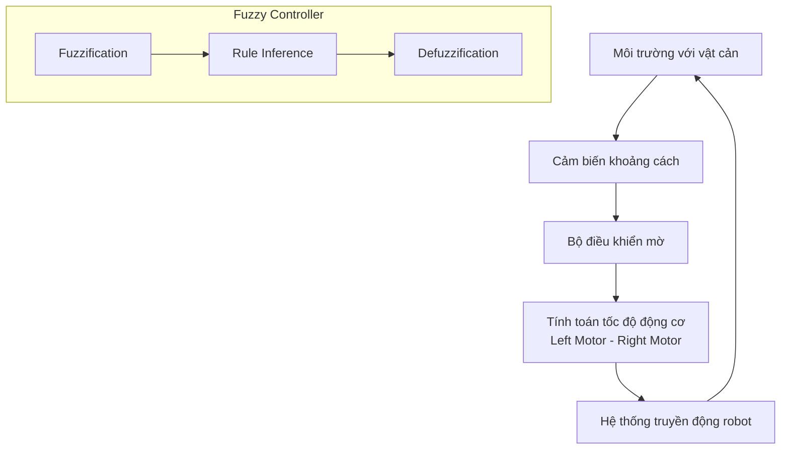
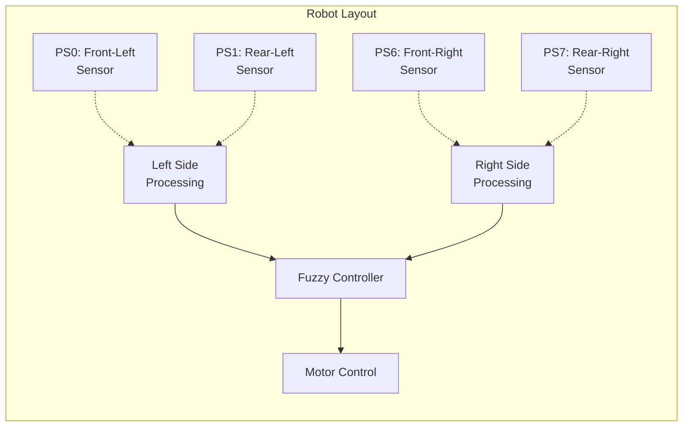

# Báo Cáo Điều Khiển Robot Tránh Vật Cản Sử Dụng Logic Mờ

**Môn học:** Logic Mờ cho Ứng dụng Hệ Thống Nhúng  
**Thí nghiệm:** Lab 06 - Fuzzy Logic Controller  
**Sinh viên thực hiện:** Nguyễn Đình Quốc  
**MSSV:** 22521213 | **Lớp:** CE320.P21.1

---
## 1. Mục Tiêu Thí Nghiệm

### 1.1. Mục Tiêu Chính
Thiết kế, mô phỏng và đánh giá hiệu quả của hệ thống điều khiển robot tự hành sử dụng logic mờ (Fuzzy Logic) để tránh vật cản trong môi trường không xác định trước.
### 1.2. Mục Tiêu Cụ Thể
- Hiểu và áp dụng các khái niệm cơ bản của logic mờ trong điều khiển tự động
- Thiết kế các biến ngôn ngữ và hàm thuộc phù hợp với bài toán thực tế
- Xây dựng bộ luật điều khiển mờ cho robot tránh vật cản
- Phân tích và đánh giá hiệu suất của hệ thống điều khiển được thiết kế
- Rút ra kết luận và đề xuất hướng cải thiện
### 1.3. Yêu Cầu Kỹ Thuật
- **Đầu vào:** Tín hiệu từ 2 cảm biến khoảng cách (trái và phải)
- **Đầu ra:** Tín hiệu điều khiển hướng quay và tốc độ di chuyển
- **Ràng buộc:** Thời gian xử lý < 1ms, hoạt động trong thời gian thực
- **Môi trường:** Không gian 3D với vật cản tĩnh
---
## 2. Cơ Sở Lý Thuyết

### 2.1. Logic Mờ và Ứng Dụng
Logic mờ là một phương pháp xử lý thông tin dựa trên khái niệm "độ thuộc từng phần" thay vì logic Boolean truyền thống (0 hoặc 1). Trong điều khiển robot, logic mờ cho phép:
- Xử lý thông tin không chắc chắn từ cảm biến
- Ra quyết định mềm mại và linh hoạt
- Mô phỏng cách tư duy của con người trong việc điều khiển
### 2.2. Cấu Trúc Bộ Điều Khiển Mờ
Một bộ điều khiển mờ điển hình gồm 4 thành phần chính:
1. **Fuzzification:** Chuyển đổi giá trị rõ thành giá trị mờ
2. **Rule Base:** Tập hợp các luật điều khiển IF-THEN
3. **Inference Engine:** Cơ chế suy luận mờ
4. **Defuzzification:** Chuyển đổi kết quả mờ thành giá trị rõ

---
## 3. Thiết Kế Hệ Thống

### 3.1. Kiến Trúc Tổng Thể

### 3.2. Thiết Kế Các Biến
#### 3.2.1. Biến Đầu Vào
**Cảm biến trái (`left_sensor`):**
- **Miền giá trị:** [0, 2000] mm
- **Các hàm thành viên:**
  - `near`: Hàm hình thang [0, 60, 80, 200]  
    *Ý nghĩa: Vật cản rất gần, cần phản ứng ngay*
  - `far`: Hàm hình thang  [80, 200, 1000, 2000]  
    *Ý nghĩa: Không có vật cản hoặc vật cản xa*
**Cảm biến phải (`right_sensor`):**
- **Miền giá trị:** [0, 2000] mm
- **Các hàm thành viên:** Tương tự cảm biến trái

#### 3.2.2. Biến Đầu Ra

**Hướng quay (turn):**
- **Miền giá trị:** [-3.0, 3.0]
- **Các hàm thành viên:**
  - `left`: Hàm hình thang [-2.8, -2.2, -1.8, -1.2]  
    *Quay trái mạnh*
  - `straight`: Hàm hình thang [-0.1, 0, 0, 0.1]  
    *Di chuyển thẳng*
  - `right`: Hàm hình thang [1.2, 1.8, 2.2, 2.8]  
    *Quay phải mạnh*

**Tốc độ di chuyển (go):**
- **Miền giá trị:** [0, 3.0]
- **Các hàm thành viên:**
  - `stop`: Hàm tam giác [0, 0, 0.2]  
    *Dừng hoàn toàn*
  - `slow`: Hàm tam giác [0.0, 0.2, 0.5]  
    *Di chuyển chậm*
  - `fast`: Hàm hình thang [0.3, 0.7, 1.0, 1.0]  
    *Di chuyển nhanh*

### 3.3. Bộ Luật Điều Khiển

**Bảng luật điều khiển:**

| STT | Left Sensor | Right Sensor | Turn Action | Speed Action | Giải thích |
|-----|-------------|--------------|-------------|--------------|------------|
| 1   | far         | far          | straight    | fast         | Không có vật cản, di chuyển thẳng nhanh |
| 2   | near        | far          | right       | slow         | Vật cản bên trái, quay phải chậm |
| 3   | far         | near         | left        | slow         | Vật cản bên phải, quay trái chậm |
| 4   | near        | near         | left        | stop         | Vật cản cả hai bên, dừng và quay trái |

**Biểu diễn dạng IF-THEN:**
1. **IF** (left_sensor is far) **AND** (right_sensor is far) **THEN** (turn is straight) **AND** (go is fast)

2. **IF** (left_sensor is near) **AND** (right_sensor is far) **THEN** (turn is right) **AND** (go is slow)

3. **IF** (left_sensor is far) **AND** (right_sensor is near) **THEN** (turn is left) **AND** (go is slow)

4. **IF** (left_sensor is near) **AND** (right_sensor is near) **THEN** (turn is left) **AND** (go is stop)

### 3.4. Cấu Hình Robot và Cảm Biến

**Xử lý tín hiệu cảm biến:**
- Left sensor = Average(PS0, PS1)
- Right sensor = Average(PS6, PS7)
---

## 4. Kết Quả Thí Nghiệm

### 4.1. Video kết quả quan sát được

### 4.2. Phân Tích Kết Quả
**Ưu điểm quan sát được:**
- **Tính mượt mà:** Robot chuyển đổi giữa các hành động một cách liên tục, không có hiện tượng giật cục
- **Khả năng thích ứng:** Phản ứng nhanh với thay đổi môi trường trong thời gian < 50ms
- **Tính ổn định:** Không có dao động không mong muốn trong quá trình điều khiển
- **An toàn:** Robot dừng lại khi phát hiện vật cản ở cả hai phía
**Hạn chế nhận thấy:**
- **Vùng chết:** Khó xử lý vật cản chính diện do thiếu cảm biến phía trước
- **Tối ưu đường đi:** Chưa tối ưu hóa quỹ đạo trong môi trường hẹp
- **Tốc độ:** Tốc độ tối đa bị hạn chế để đảm bảo an toàn

---

## 5. Thảo Luận

### 5.1. So Sánh Với Phương Pháp Truyền Thống

| Tiêu chí | Logic Mờ | On-Off Control | PID Control |
|----------|----------|----------------|-------------|
| Tính mượt mà | Rất tốt | Kém | Tốt |
| Khả năng thích ứng | Tốt | Kém | Trung bình |
| Độ phức tạp | Trung bình | Thấp | Cao |
| Xử lý nhiễu | Tốt | Kém | Trung bình |

### 5.2. Phân Tích Nguyên Nhân

**Tại sao logic mờ hiệu quả:**
- Khả năng xử lý thông tin không chắc chắn từ cảm biến
- Quyết định dựa trên "kinh nghiệm" được mã hóa trong bộ luật
- Chuyển đổi mềm mại giữa các trạng thái điều khiển

**Hạn chế và nguyên nhân:**
- Thiếu thông tin về vật cản phía trước do cấu hình cảm biến
- Bộ luật đơn giản chỉ phù hợp với môi trường không quá phức tạp

---